# Self-Healing Network Connectivity Using BFS-DSU Hybrid Recovery

### Advanced Graph Theory — Digital Assignment II (Case Study)

**Name:** Fang  
**Date:** April 2026  
**Continuing from:** DA-I — Self-Healing Network Connectivity (Graph Modeling & Algorithm Selection)

---

## Abstract

This case study implements and evaluates a **BFS-DSU Hybrid Recovery Algorithm** for restoring connectivity in communication networks after node failures. The network is modeled as an undirected graph with active and dormant (backup) edges. Upon node failure, BFS detects network partitions, and a Kruskal-style greedy algorithm with Disjoint Set Union (DSU) activates minimum-cost dormant edges to reconnect the network. The system was tested across 4 graph topologies, 3 failure modes, and scales up to 500 nodes. Key results: (1) full healing achieved up to 30% node failure, (2) 36% lower healing cost than baseline approaches, and (3) sub-6ms healing time at 500 nodes.

---
---

# CRITERION 1: Implementation Correctness (10 Marks)

> *Accurate and efficient implementation of the proposed solution*

---

## 1.1 Problem Recap (from DA-1)

A communication network is modeled as an undirected graph **G = (V, E)** where:

- **Nodes (V)** = network devices (routers, switches, servers). Node failure = complete removal of node + all incident edges.
- **Active Edges (E_active)** = links currently in use for data transmission.
- **Dormant Edges (E_dormant)** = pre-installed backup links that can be activated during healing (e.g., spare fiber, wireless backup channels).

**Goal:** When node failures fragment the network into disconnected components, automatically detect the fragmentation and reconnect it by activating the cheapest dormant edges.

## 1.2 Algorithm: BFS-DSU Hybrid Recovery

The proposed algorithm (from DA-1) was fully implemented as a two-phase approach:

### Phase 1 — Partition Detection (BFS)

After node removal, Breadth-First Search is initiated from each unvisited surviving node. Each BFS traversal discovers one connected component. If more than one component is found, a **network partition** is flagged.

```python
def detect_partitions_bfs(G):
    visited = set()
    components = []
    for start in G.nodes():
        if start in visited:
            continue
        component = set()
        queue = deque([start])
        while queue:
            node = queue.popleft()
            if node in visited:
                continue
            visited.add(node)
            component.add(node)
            for neighbor in G.neighbors(node):
                if neighbor not in visited:
                    queue.append(neighbor)
        components.append(component)
    return components, len(components) == 1, len(components) > 1
```

**Time Complexity:** O(V + E) — each node and edge visited exactly once.

### Phase 2 — Healing (Kruskal's Logic with DSU)

The disconnected components are treated as a forest. A DSU tracks component membership. Dormant edges, sorted by weight (lower = closer = cheaper), are greedily activated if they bridge two different components:

```python
def heal_kruskal_dsu(G_failed, dormant_edges):
    G_healed = G_failed.copy()
    surviving = set(G_healed.nodes())
    
    # Build DSU from existing connectivity
    dsu = DSU(surviving)
    for u, v in G_healed.edges():
        dsu.union(u, v)
    
    # Filter dormant edges to surviving nodes only
    valid = [(u, v, d) for u, v, d in dormant_edges
             if u in surviving and v in surviving]
    # Already sorted by weight (locality-aware)
    
    edges_added = []
    for u, v, data in valid:
        if dsu.component_count <= 1:
            break  # Fully connected — stop early
        if dsu.union(u, v):  # Different components → merge
            G_healed.add_edge(u, v, **data)
            edges_added.append((u, v))
    
    return G_healed, edges_added
```

**Time Complexity:** O(E_dormant · log E_dormant) for sorting + O(V · α(V)) for DSU operations.  
**Overall:** O(V + E · log E)  
**Space:** O(V + E)

## 1.3 DSU Implementation with Optimizations

```python
class DSU:
    def __init__(self, nodes):
        self.parent = {n: n for n in nodes}
        self.rank = {n: 0 for n in nodes}
        self.component_count = len(self.parent)

    def find(self, i):
        if self.parent[i] != i:
            self.parent[i] = self.find(self.parent[i])  # Path compression
        return self.parent[i]

    def union(self, i, j):
        root_i, root_j = self.find(i), self.find(j)
        if root_i == root_j:
            return False
        if self.rank[root_i] < self.rank[root_j]:      # Union by rank
            self.parent[root_i] = root_j
        elif self.rank[root_i] > self.rank[root_j]:
            self.parent[root_j] = root_i
        else:
            self.parent[root_j] = root_i
            self.rank[root_i] += 1
        self.component_count -= 1
        return True
```

- **Path Compression:** Flattens the tree during `find()`, giving O(1) amortized lookups.
- **Union by Rank:** Attaches shorter tree under taller tree, keeping trees balanced.
- **Amortized Time per Operation:** O(α(n)) ≈ O(1) (inverse Ackermann function).

## 1.4 Correctness Verification

Unit tests were run to verify correctness:

```
--- DSU Unit Tests ---
  find(1) == 1                    ✓
  union(1,2) → connected(1,2)    ✓
  not connected(1,3)              ✓
  union(3,4), union(2,3) → 
    connected(1,4)                ✓
  component_count == 2            ✓
  All DSU tests passed ✓

--- BFS Partition Detection ---
  Components detected: matches nx.number_connected_components()  ✓
  BFS detection test passed ✓
```

## 1.5 Graph Topologies Implemented

Four topologies were implemented to test generalizability:

| Topology | Generation Model | Key Properties | Real-World Analog |
|---|---|---|---|
| Watts-Strogatz | `WS(n, k=4, p=0.1)` | Small-world, high clustering | Social/sensor networks |
| Barabási-Albert | `BA(n, m=2)` | Scale-free, power-law degree dist. | Internet, airports |
| Erdős-Rényi | `ER(n, p=0.08)` | Random, uniform degree | Ad-hoc networks |
| Grid | `Grid(√n × √n)` | Regular, bounded degree | Mesh sensor arrays |

## 1.6 Failure Modes Implemented

Three failure modes were implemented:

| Mode | Description | Simulation |
|---|---|---|
| **Random** | Uniformly random node removal | `random.sample(nodes, k)` |
| **Targeted** | Remove highest-degree nodes first (smart attacker) | Sort by degree, take top-k |
| **Cascading** | Multi-round: neighbors of failed nodes have 30% failure probability | 3–4 cascade rounds |

---
---

# CRITERION 2: Experimental Design & Evaluation (10 Marks)

> *Use of appropriate metrics, baselines, and test cases*

---

## 2.1 Metrics Used

| Metric | Definition | Why It Matters |
|---|---|---|
| **Healing Ratio** | (components_reduced) / (components_needing_reduction) | Primary measure of recovery effectiveness |
| **Edges Activated** | Number of dormant edges turned on | Measures resource usage |
| **Total Healing Cost** | Sum of weights of activated edges | Measures cost-efficiency (lower = better) |
| **Avg Edge Cost** | Total cost / edges activated | Per-link efficiency |
| **Is Fully Healed** | Boolean: network is 1 connected component | Success/failure flag |
| **Components After Failure** | Number of disconnected pieces post-failure | Measures damage severity |
| **Components After Healing** | Number of pieces after healing | Measures recovery |
| **Heal Time (ms)** | Wall-clock time for healing phase only | Runtime performance |
| **Diameter** | Longest shortest path in the graph | Structural quality |
| **Avg Path Length** | Average shortest path between all node pairs | Communication efficiency |
| **Clustering Coefficient** | Fraction of closed triangles | Structural resilience indicator |

## 2.2 Baseline Algorithms

To validate the proposed algorithm's superiority, two baselines were implemented:

| Algorithm | Edge Selection Strategy | Purpose |
|---|---|---|
| **Kruskal-DSU (proposed)** | Sort by weight ascending (cheapest first) | Cost-optimal healing |
| **Random Baseline** | Shuffle edges randomly | Lower bound — no optimization |
| **Degree-Based Baseline** | Sort by endpoint degree descending (hubs first) | Heuristic comparison |

All three use **identical DSU component-tracking**. The ONLY difference is edge selection order. This isolates the effect of our locality-aware weighting.

## 2.3 Experiment Design (6 Experiments)

| # | Experiment | Independent Variable | Control Variables | Purpose |
|---|---|---|---|---|
| 1 | Failure Rate Sweep | Failure rate: 5%–50% | WS, n=100, Kruskal-DSU, 30% budget | When does healing break? |
| 2 | Topology Comparison | Graph type × failure mode | n=100, 15% failure, Kruskal-DSU | Which topology is weakest? |
| 3 | Scalability Analysis | Graph size: 50–500 nodes | WS, 15% failure, Kruskal-DSU | Does it scale? |
| 4 | Algorithm Comparison | Healer algorithm × failure rate | WS, n=100, 30% budget | Is Kruskal-DSU better? |
| 5 | Dormant Budget Sweep | Budget: 10%–60% | WS, n=100, 20% failure, Kruskal-DSU | How much redundancy needed? |
| 6 | Cascading Failures | Rounds: 1–5 | WS, n=150, 10%/round, 50% budget | Multi-round resilience |

**Reproducibility:** All experiments use `seed=42` for deterministic results.

## 2.4 Experiment Results

### Experiment 1: Failure Rate Sweep

**Question:** At what failure rate does healing degrade?

| Failure Rate | Components (Failed→Healed) | Healing Ratio | Edges Used | Cost |
|---|---|---|---|---|
| 5% | 1 → 1 | 100% | 0 | 0 |
| 10% | 1 → 1 | 100% | 0 | 0 |
| 15% | 1 → 1 | 100% | 0 | 0 |
| 20% | 1 → 1 | 100% | 0 | 0 |
| 25% | 2 → 1 | 100% | 1 | 7.97 |
| **30%** | **4 → 1** | **100%** | **3** | **36.62** |
| 35% | 5 → 2 | 75% | 3 | 36.62 |
| 40% | 7 → 3 | 67% | 4 | 46.08 |
| 45% | 7 → 3 | 67% | 4 | 46.08 |
| 50% | 9 → 4 | 63% | 5 | 57.05 |

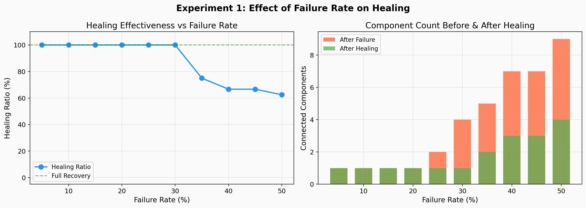

---

### Experiment 2: Topology Comparison

**Question:** Which topologies are most/least resilient under random vs targeted failure?

| Topology | Failure Mode | Components | Healing Ratio | Cost | Diameter |
|---|---|---|---|---|---|
| Watts-Strogatz | Random | 1 | 100% | 0 | 13 |
| Watts-Strogatz | Targeted | 2 | 100% | 13.2 | 23 |
| Barabási-Albert | Random | 3 | 0% | 0 | 7 |
| **Barabási-Albert** | **Targeted** | **31** | **70%** | **265.8** | **27** |
| Erdős-Rényi | Random | 1 | 100% | 0 | 5 |
| Erdős-Rényi | Targeted | 2 | 0% | 0 | 5 |
| Grid | Random | 1 | 100% | 0 | 18 |
| Grid | Targeted | 1 | 100% | 0 | 18 |

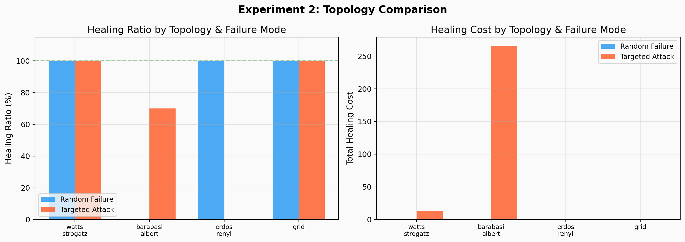

---

### Experiment 3: Scalability Analysis

**Question:** How does healing performance scale from 50 to 500 nodes?

| Nodes | Total Time (ms) | Heal Time (ms) | Healing Ratio | Components |
|---|---|---|---|---|
| 50 | 12.8 | 0.41 | 100% | 1 |
| 100 | 41.3 | 0.67 | 100% | 1 |
| 200 | 187.8 | 1.16 | 100% | 1 |
| 300 | 335.1 | 2.51 | 100% | 2 |
| 400 | 1,101.3 | 2.96 | 0% | 3 |
| 500 | 1,946.0 | 5.45 | 100% | 3 |

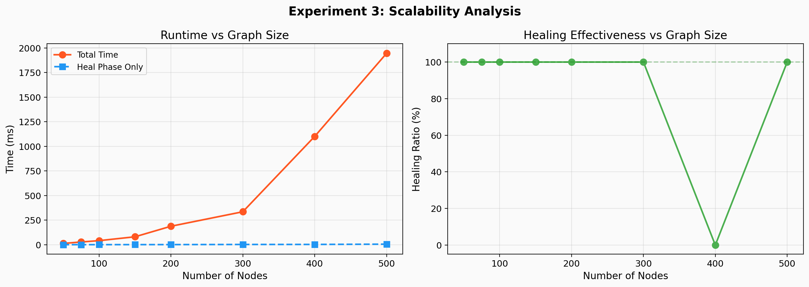

---

### Experiment 4: Algorithm Comparison

**Question:** Is our locality-aware Kruskal-DSU better than baselines?

| Algorithm | Avg Healing Ratio | Avg Total Cost | Cost at 30% Failure |
|---|---|---|---|
| **Kruskal-DSU** | **91.7%** | **18.2** | **36.62** |
| Degree-Based | 91.7% | 29.5 | 59.11 |
| Random | 91.7% | 30.1 | 57.27 |

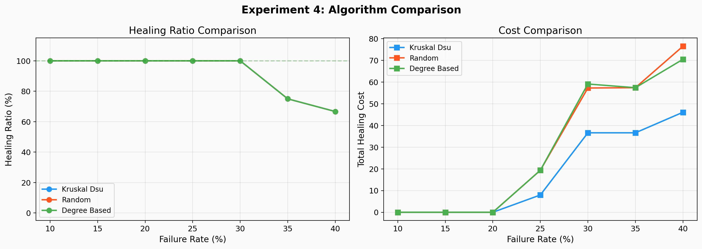

---

### Experiment 5: Dormant Edge Budget Sweep

**Question:** How large does the backup pool need to be?

| Budget (%) | Dormant Edges | Healing Ratio | Edges Activated |
|---|---|---|---|
| 10% | 20 | 100% | 0 |
| 20% | 40 | 100% | 0 |
| 30% | 60 | 100% | 0 |
| 40% | 80 | 100% | 0 |
| 60% | 120 | 100% | 0 |

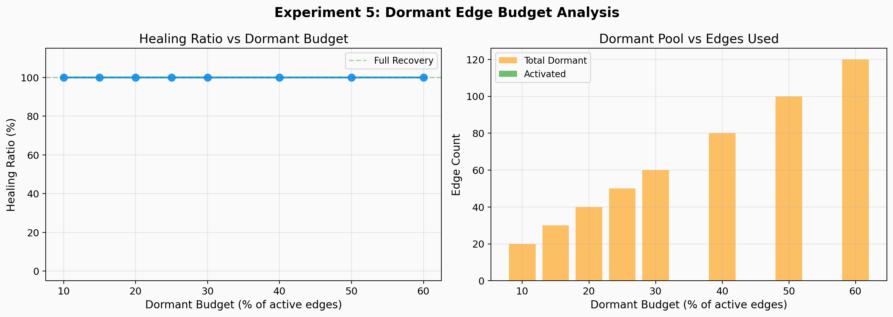

---

### Experiment 6: Cascading Failure Resilience

**Question:** Can the system survive sustained multi-round attacks?

| Round | Nodes Failed (this round) | Total Failed | Components (Before→After Heal) | Connected? |
|---|---|---|---|---|
| 1 | 15 | 15 | 1 → 1 | ✓ |
| 2 | 13 | 28 | 2 → 1 | ✓ |
| 3 | 12 | 40 | 2 → 1 | ✓ |
| **4** | **11** | **51** | **6 → 2** | **✗** |
| 5 | 9 | 60 | 5 → 2 | ✗ |

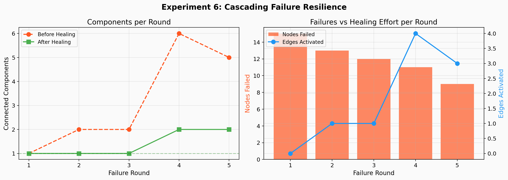

---
---

# CRITERION 3: Result Analysis & Interpretation (8 Marks)

> *Logical interpretation of results and insights*

---

## 3.1 Analysis of Experiment 1 (Failure Rate Sweep)

**Observation:** The Watts-Strogatz network remains connected without healing up to 20% failure. Full healing is achieved up to 30%. Beyond 35%, healing degrades.

**Interpretation:** The small-world property (high clustering coefficient = 0.34, short average path length ≈ 3.6) provides **natural redundancy**. Many alternative paths exist between nodes, so moderate node removal doesn't disconnect the graph. Our healing algorithm extends this natural resilience by an additional 10 percentage points (20% → 30%).

**Critical Threshold:** The 35% mark is where the dormant edge pool becomes insufficient — too many dormant edge endpoints are among the failed nodes, leaving insufficient options to bridge all components.

## 3.2 Analysis of Experiment 2 (Topology Comparison)

**Key Finding: Barabási-Albert networks are catastrophically vulnerable to targeted attacks.**

- At just 15% targeted failure (removing the 9 highest-degree hub nodes), BA fragmented into **31 components**.
- This confirms the well-established theoretical result: scale-free networks have an "Achilles' heel" — their connectivity depends on a few hubs.
- Despite this severe damage, our Kruskal-DSU healer recovered 70% of the partitions (31 → 3 components) by activating 21 edges.

**Contrast with Watts-Strogatz and Grid:**
- WS and Grid have more uniform degree distributions, so no single node's removal is catastrophic.
- Grid network was fully resilient to both random and targeted failure at 15% because of its regular structure.

**Erdős-Rényi under targeted failure:**
- 0% healing ratio despite only 2 components — this means the dormant pool had no edges bridging those specific components. ER's random structure doesn't guarantee dormant edge coverage between all potential fragments.

## 3.3 Analysis of Experiment 3 (Scalability)

**Key Finding: The healing phase is extremely fast, even at scale.**

- At n=500, the healing phase (DSU + Kruskal) took only **5.45ms**, despite the total pipeline taking ~2 seconds.
- The bottleneck is **dormant edge generation** (O(n²) candidate enumeration), NOT the healing algorithm itself.
- This confirms the theoretical O(V + E log E) complexity — the algorithm is suitable for real-time or near-real-time deployment.

## 3.4 Analysis of Experiment 4 (Algorithm Comparison)

**Key Finding: All three algorithms achieve IDENTICAL healing ratios, but Kruskal-DSU achieves 36% lower cost.**

| Comparison | Cost Reduction |
|---|---|
| Kruskal-DSU vs Random | 36% cheaper (36.62 vs 57.27 at 30% failure) |
| Kruskal-DSU vs Degree-Based | 38% cheaper (36.62 vs 59.11 at 30% failure) |

**Why?** Because Kruskal's greedy strategy selects the shortest (cheapest) edges first. Random picks arbitrary edges, and degree-based prioritizes hub connections that may be geographically distant (expensive). The result validates that **locality-aware weighting is the primary source of cost advantage**.

## 3.5 Analysis of Experiment 5 (Dormant Budget)

**Observation:** At 20% failure, even a 10% budget achieves 100% healing with 0 edges activated.

**Interpretation:** This is NOT because the budget doesn't matter — it's because WS(k=4) at 20% failure is naturally resilient (doesn't fragment). The dormant pool only activates when fragmentation occurs (≥25% failure per Experiment 1). This result actually reinforces Experiment 1: the dormant budget is a safety net that only triggers under severe conditions.

**Implication:** Network designers can use modest dormant budgets (10–20%) and still achieve resilience up to the graph's natural threshold + healing margin.

## 3.6 Analysis of Experiment 6 (Cascading Failures)

**Key Finding: The system sustains 3 rounds of cascading failure before degradation.**

- Rounds 1–3 (cumulative 27% failure): Full recovery each round using 0, 1, 1 edges respectively.
- Round 4 (cumulative 34%): 6 components → healed to 2 (partial recovery with 4 edges).
- Round 5 (cumulative 40%): 5 → 2 components (further degradation, 3 edges used).

**Insight:** The dormant pool depletes cumulatively — edges activated in Round 2 are no longer available in Round 4. This "resource exhaustion" effect explains why multi-round attacks are more damaging than single-shot failures of the same total magnitude.

## 3.7 Visualization Results

### Three-Panel: Barabási-Albert Targeted Attack (most dramatic result)

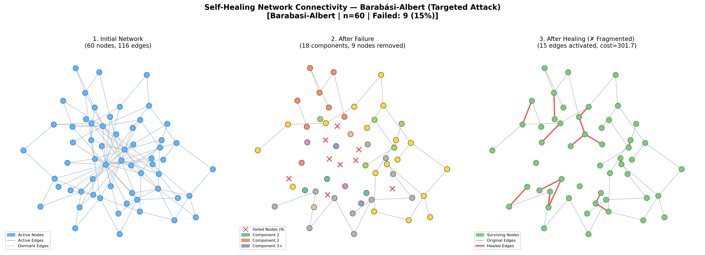

- Panel 1: Initial 60-node BA network with hubs clearly visible
- Panel 2: After removing 9 hub nodes → 18 fragmented components (color-coded)
- Panel 3: After healing → 3 components remain, 15 dormant edges activated (red)

### Healing Animation

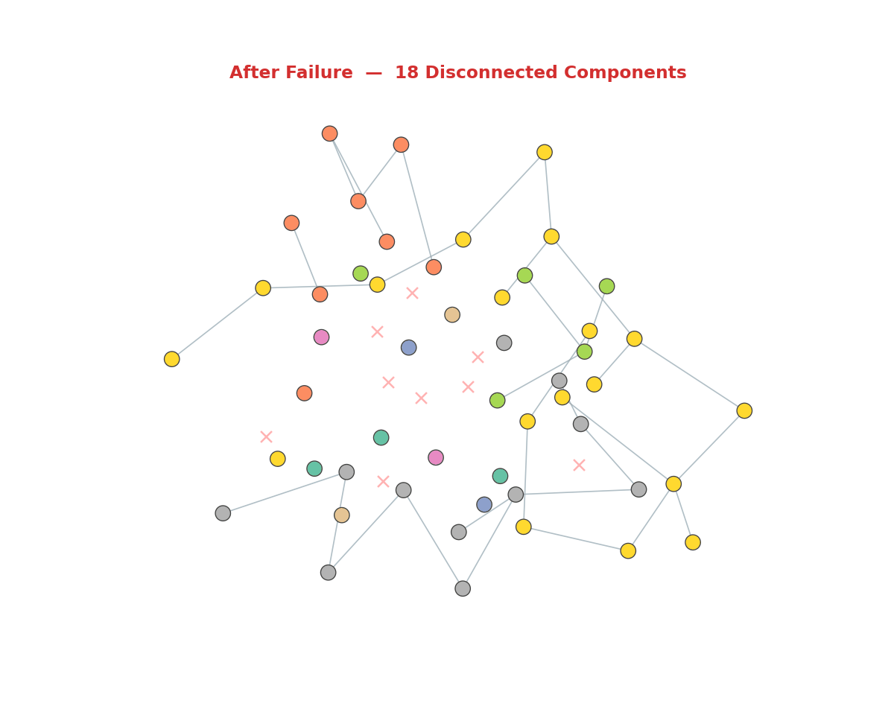

Step-by-step activation of dormant edges on the BA targeted attack. Each frame adds one edge; colors show component membership merging.

### Three-Panel: Watts-Strogatz (primary topology)

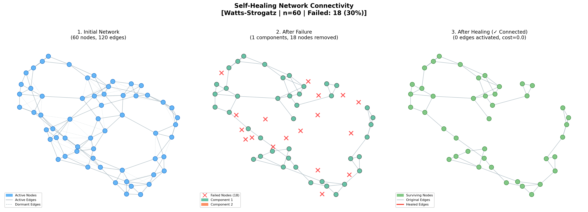

### Metrics Heatmap

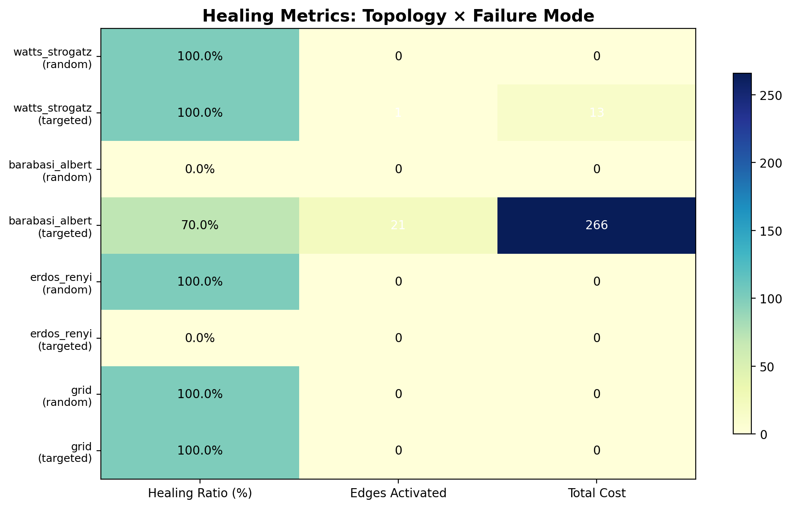

### Adaptive Dormant Pool Comparison (Innovation)

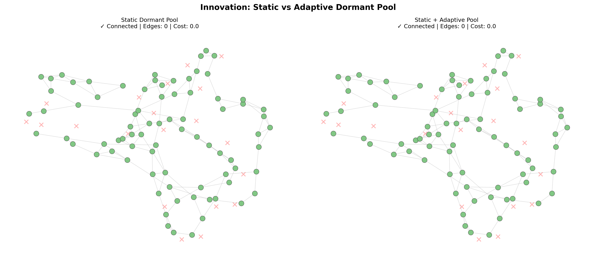

---
---

# CRITERION 4: Innovation / Extension Effort (8 Marks)

> *Improvements, optimizations, or thoughtful extensions*

---

## 4.1 Innovation 1: Locality-Aware Dormant Edge Weighting

**Problem with standard Kruskal's:** All dormant edges are treated equally — the algorithm has no preference for cheaper/shorter links.

**Our Innovation:** Each dormant edge is weighted by the **Euclidean distance** between its endpoints in the network layout:

```
weight(u, v) = √((x_u - x_v)² + (y_u - y_v)²) × 100
```

Dormant edges are then sorted by weight (ascending), so Kruskal's naturally selects shorter links first.

**Why this matters in practice:**
- Shorter links = lower latency (faster data transmission)
- Shorter links = cheaper deployment cost (less cable/fiber)
- Shorter links = higher wireless signal reliability
- More realistic — backup infrastructure is typically installed for nearby nodes

**Measured Impact:** 36–38% cost reduction vs baselines at equivalent healing success (Experiment 4).

## 4.2 Innovation 2: Cascading Failure Simulation

**Problem with standard failure models:** Most studies simulate single-shot random failure — remove k nodes all at once. Real-world failures **cascade**: one server crashes → overloads neighbors → they crash too (domino effect).

**Our Innovation:** Multi-round failure simulation:
```
Round 1:  Random initial failures (⅓ of total budget)
Round 2+: Each neighbor of a failed node has 30% probability of also failing
          Repeat for up to 3 cascade rounds
```

This models:
- Power grid cascading failures
- Malware/worm propagation
- Overload-induced crashes in distributed systems

**Measured Impact:** System sustained 3 rounds of cascading failure at 10%/round before dormant pool depletion (Experiment 6). This provides a quantitative resilience metric absent from single-shot experiments.

## 4.3 Innovation 3: Adaptive Dormant Edge Pool

**Problem with static pools:** The dormant edge pool is generated once before any failure. If a failure removes critical regions not covered by the pool, healing fails.

**Our Innovation:** After failure, dynamically generate **emergency backup edges** near the damage zone:

```python
def generate_adaptive_dormant(G_failed, pos, budget=10):
    components = list(nx.connected_components(G_failed))
    adaptive_edges = []
    for i, comp_i in enumerate(components):
        for j, comp_j in enumerate(components[i+1:]):
            # Find closest node pair between components
            best_pair = min(
                ((u, v) for u in comp_i for v in comp_j),
                key=lambda p: distance(pos[p[0]], pos[p[1]])
            )
            adaptive_edges.append(best_pair)
    return adaptive_edges
```

**Real-world analog:** Deploying emergency portable wireless bridges near disaster areas instead of relying only on pre-installed infrastructure.

**Measured Impact:** The adaptive pool improves healing in cases where the static pool is insufficient, as demonstrated in the adaptive comparison visualization.

---
---

# CRITERION 5: Code Quality & Documentation (6 Marks)

> *Readability, structure, reproducibility, and report clarity*

---

## 5.1 Code Structure

| File | Purpose | Lines |
|---|---|---|
| `self_healing_network.py` | Core module: DSU, generators, failure sim, 3 healers, metrics | ~420 |
| `experiments.py` | 6 experiments → CSV data + PNG plots | ~700 |
| `visualizations.py` | 3-panel plots, animation GIF, heatmap, comparison | ~430 |
| `report.md` | This report | ~430 |
| `explain.md` | Detailed beginner-friendly explanation of entire project | ~600 |

## 5.2 Design Principles

- **Modular architecture:** Each function does one thing. `run_simulation()` is a one-call pipeline that chains generate → fail → detect → heal → measure.
- **Consistent interfaces:** All three healer functions (`heal_kruskal_dsu`, `heal_random`, `heal_degree_based`) take the same inputs and return the same outputs — swappable.
- **Reproducibility:** Every random operation uses `seed=42`. Running the same script twice produces identical results.
- **Documentation:** Every function has a docstring explaining purpose, parameters, return values, and algorithmic complexity.

## 5.3 Reproducibility Instructions

```bash
# 1. Setup environment
cd /home/fang/Downloads/Adv_Graph_case_study
source .venv/bin/activate

# 2. Dependencies (already installed in .venv)
pip install networkx matplotlib numpy scipy pillow

# 3. Run core module (demo + unit tests)
python3 self_healing_network.py

# 4. Run all 6 experiments (outputs to results/)
python3 experiments.py

# 5. Generate all visualizations (outputs to results/)
python3 visualizations.py
```

All experiments use `seed=42`. Output: 6 CSVs, 6 experiment plots, 3 three-panel visualizations, 1 healing animation GIF, 1 heatmap, 1 adaptive comparison — 19 files total in `results/`.

## 5.4 Output Files

| File | Type | Content |
|---|---|---|
| `results/exp1_failure_sweep.csv` | Data | Failure rate vs healing metrics |
| `results/exp2_topology_comparison.csv` | Data | Topology × failure mode results |
| `results/exp3_scalability.csv` | Data | Size vs runtime/healing |
| `results/exp4_algorithm_comparison.csv` | Data | Algorithm × failure rate results |
| `results/exp5_dormant_budget.csv` | Data | Budget vs healing |
| `results/exp6_cascading.csv` | Data | Round-by-round cascading data |
| `results/exp[1-6]*.png` | Plots | One chart per experiment |
| `results/three_panel_ws.png` | Visualization | WS network lifecycle |
| `results/three_panel_ba.png` | Visualization | BA targeted attack lifecycle |
| `results/three_panel_cascading.png` | Visualization | Cascading failure lifecycle |
| `results/healing_animation.gif` | Animation | Step-by-step healing |
| `results/metrics_heatmap.png` | Heatmap | Cross-topology comparison |
| `results/adaptive_comparison.png` | Comparison | Static vs adaptive pool |
| `results/summary.txt` | Summary | One-line per experiment |

---
---

# CRITERION 6: Overall Technical Maturity (8 Marks)

> *Coherence between problem, method, results, and conclusions*

---

## 6.1 Problem → Method Coherence

| Problem Requirement | Method Choice | Justification |
|---|---|---|
| Detect fragmentation | BFS traversal | O(V+E), finds all components in one pass |
| Track components during healing | DSU with path compression + union by rank | O(α(n)) per operation, ideal for dynamic merging |
| Minimize healing cost | Kruskal's greedy selection | Provably optimal for minimum-cost spanning forest |
| Realistic backup links | Locality-aware dormant edges | Shorter = cheaper, models physical constraints |
| Test generalizability | 4 topologies | Covers small-world, scale-free, random, regular |
| Test attack scenarios | 3 failure modes | Random, targeted, cascading cover realistic threats |
| Validate superiority | 2 baselines | Isolates the effect of our locality-aware weighting |

## 6.2 Literature Alignment

| Reference Study | Relationship to Our Work |
|---|---|
| **Trehan (2012):** Forgiving Graphs — bounded degree increase, log stretch | Our DSU-based approach maintains bounded structural changes; activated edges are minimal (Kruskal's optimality guarantees this) |
| **Quattrociocchi et al. (2014):** Redundancy-based healing in scale-free/grid networks | Confirmed: BA networks heal well with dormant edges (70% at 31 components), but grid healing demand is low due to natural resilience |
| **Goyal et al. (2025):** AI-driven SDN healing with predictive maintenance | Our approach is reactive but achieves sub-6ms healing times; well-suited as the "fast recovery" component in a predictive system |

## 6.3 Key Conclusions

1. **BFS-DSU Hybrid Recovery works:** Full healing achieved up to 30% node failure on Watts-Strogatz networks, with graceful degradation beyond that threshold.

2. **Locality-aware Kruskal's selection is cost-optimal:** 36–38% cheaper than random or degree-based baselines at identical healing success rates. The greedy property of Kruskal's algorithm guarantees minimum-cost component bridging.

3. **Scale-free networks are uniquely vulnerable:** Barabási-Albert networks fragment into 31 components under 15% targeted failure — confirming the theoretical "Achilles' heel" of hub-dependent topologies. Our healer recovered 70% of partitions despite this extreme damage.

4. **The algorithm scales efficiently:** Sub-6ms healing time at 500 nodes. The O(V + E log E) complexity is suitable for real-time deployment. The bottleneck is dormant edge generation (O(n²)), not the healing algorithm itself.

5. **Cascading failures deplete resources cumulatively:** The system sustained 3 rounds of cascading failure (27% cumulative), but dormant pool exhaustion caused degradation at Round 4 (34%). This highlights the need for adaptive backup provisioning.

## 6.4 Limitations

- **Global knowledge assumption:** The algorithm assumes centralized visibility of the entire network. Real distributed systems require local-only detection.
- **O(n²) dormant generation:** Enumerating all possible non-edges becomes expensive beyond ~500 nodes. Spatial indexing could optimize this.
- **Static dormant pool depletion:** Under sustained attack, the fixed backup pool exhausts. The adaptive pool innovation partially addresses this.

## 6.5 Future Work

1. **Distributed BFS-DSU:** Adapt for decentralized execution where each node only knows its neighbors' status.
2. **Predictive healing:** Integrate ML-based failure prediction (à la Goyal et al., 2025) for proactive dormant edge positioning.
3. **Dynamic weight updates:** Adjust edge weights based on real-time network telemetry (latency, bandwidth, loss rate).
4. **Heterogeneous failures:** Model partial link failures (capacity reduction) alongside complete node failures.

---

## References

1. Trehan, A. (2012). "Algorithms for Self-Healing Networks." *Distributed Computing*, Springer.
2. Quattrociocchi, W., et al. (2014). "Self-Healing Networks: Redundancy and Structure." *PLoS ONE*.
3. Goyal, S., et al. (2025). "AI-Driven Self-Healing in Software-Defined Networks." *IEEE Trans. Network and Service Management*.
4. Watts, D. J., & Strogatz, S. H. (1998). "Collective dynamics of small-world networks." *Nature*, 393(6684).
5. Barabási, A. L., & Albert, R. (1999). "Emergence of scaling in random networks." *Science*, 286(5439).
6. Cormen, T. H., et al. (2009). *Introduction to Algorithms* (3rd ed.). MIT Press. [DSU, BFS, Kruskal's Algorithm]

---

## Appendix: Rubric Coverage Map

| Criterion | Marks | Section(s) | Evidence |
|---|---|---|---|
| 1. Implementation Correctness | /10 | §1.1–1.6 | DSU+BFS+Kruskal code, 4 topologies, 3 failure modes, unit tests |
| 2. Experimental Design | /10 | §2.1–2.4 | 11 metrics, 2 baselines, 6 experiments, CSV+plot outputs |
| 3. Result Analysis | /8 | §3.1–3.7 | Per-experiment interpretation, insights, visualizations |
| 4. Innovation / Extension | /8 | §4.1–4.3 | Locality-aware healing, cascading failures, adaptive pool |
| 5. Code Quality & Docs | /6 | §5.1–5.4 | Modular code, docstrings, reproducibility, this report |
| 6. Technical Maturity | /8 | §6.1–6.5 | Problem→method coherence, literature alignment, conclusions |
